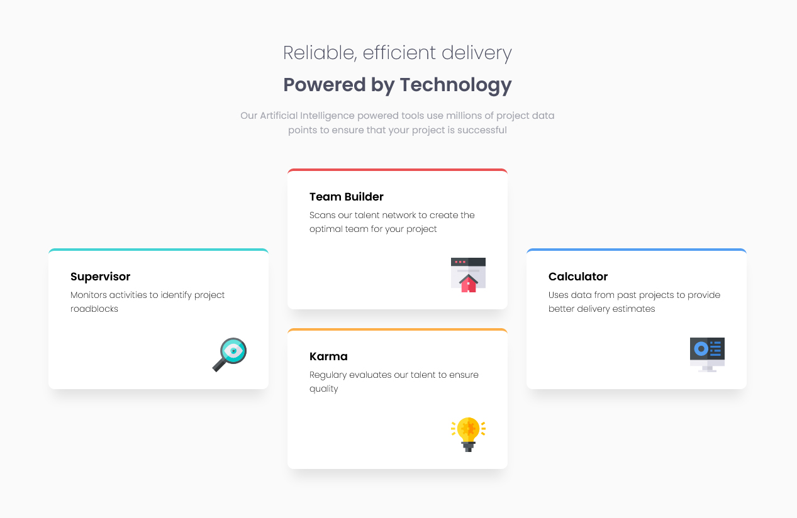

# Four Card Feature


## Table of contents

- [Overview](#overview)
  - [The challenge](#the-challenge)
  - [Screenshots](#screenshot)
  - [Links](#links)
- [My process](#my-process)
  - [Built with](#built-with)
  - [What I learned](#what-i-learned)
- [Author](#author)
- [Acknowledgments](#acknowledgments)


## Overview

### The challenge

A design featuring four cards have been given. We have to code the website in such a way so that users are able to view the optimal layout for the site depending on their device's screen size.

### Screenshots



Desktop Version

<br>


Mobile Version


### Links

- Solution URL: [GitHub Repository](https://github.com/soumalyapakrashi/four-card-feature)
- Live Site URL: [Four Card Feature - Github Pages](https://soumalyapakrashi.github.io/four-card-feature)

## My process

### Built with

- CSS custom properties
- CSS Grid
- Mobile-first workflow
- React


### What I learned

The biggest thing I learned from this project is that we cannot just give the URL of a local image and expect it to show up in React. We will have to import the image as follows:

```js
import image from "./images/image.jpg";
```

Only then will the image show up and not give any errors.

I also learned about CSS transitions and the Grid layout.


## Author

- Twitter - [@iamspakrashi](https://twitter.com/iamspakrashi)
- GitHub - [Soumalya Pakrashi](https://github.com/soumalyapakrashi)

## Acknowledgments

The idea and designs of this project has been taken from Frontend Mentor website named [Four Card Feature Section Challenge](https://www.frontendmentor.io/challenges/four-card-feature-section-weK1eFYK).
